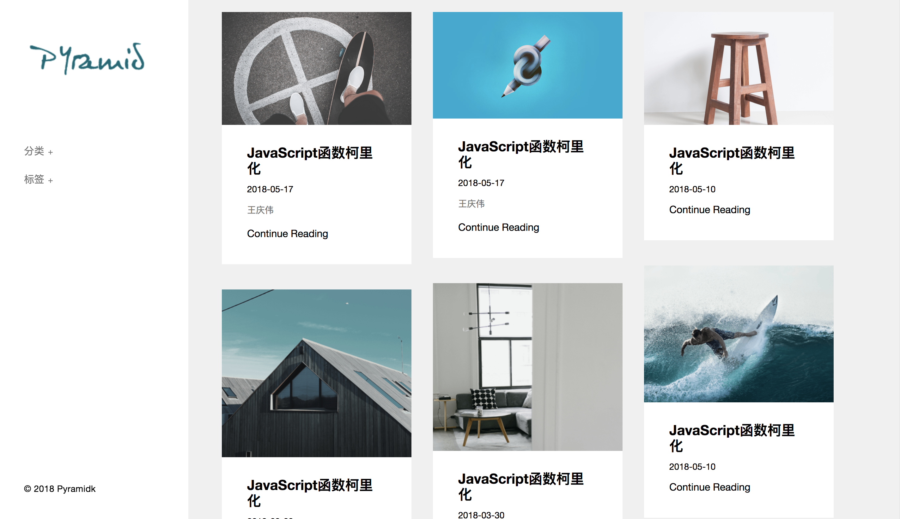

# Pyramid-Blog

> A blog created by python, django and vue.

## Usage

About the server

``` bash
python manage.py runserver
```

About the frontend

``` bash
# install dependencies
yarn or npm install

# serve with hot reload at localhost:8080
yarn dev or npm run dev

# build for production with minification
npm run build

# build for production and view the bundle analyzer report
npm run build --report
```

## Screenshot


